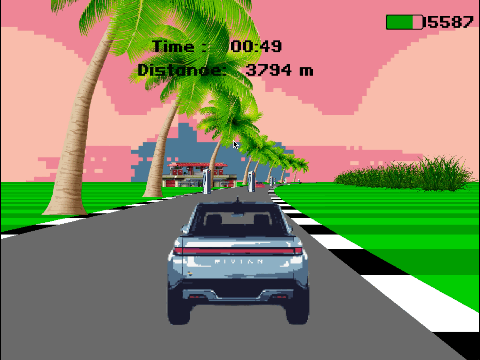
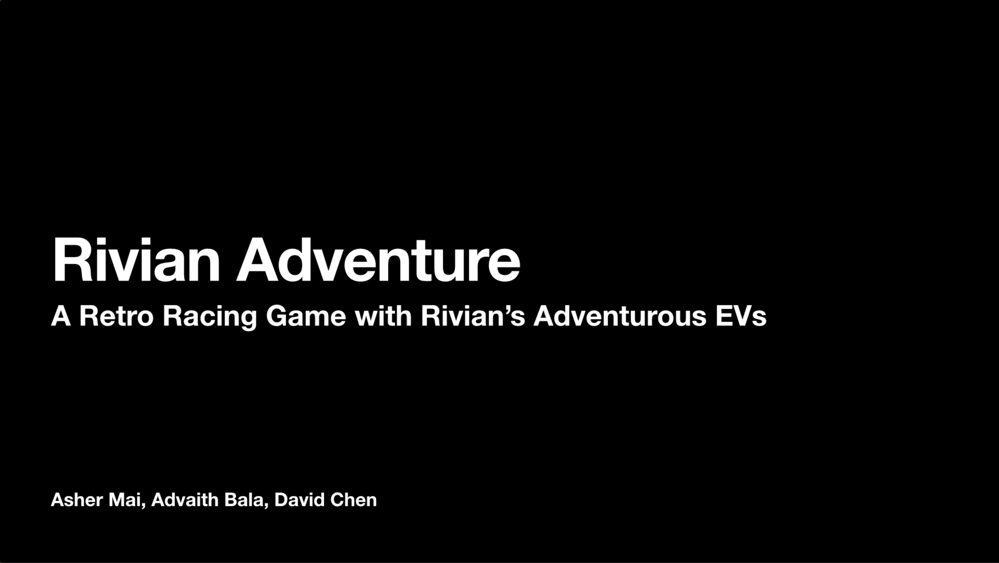

# Rivian Adventure

## Overview
2023 Research Park Hackathon 

Team Name: Rivian R1S

Team Members: Asher Mai, Advaith Bala, David Chen

This game is built on top of [Racing Pseudo 3D in Python](https://github.com/brccabral/RacingPseudo3DPython)



## Youtube Demo:

[](https://youtu.be/4WL72N0womw "Rivian Adventure")

## Installation and Compatibility

This game has been tested on both Mac and PC with Python 3.9.6

Please install the following

```
pip install pygame==2.1.2    
```

## How to Play

To start the game:
```
python3 main.py    
```
### Basic Controls

🚀 **Move/Accelerate**: Use the **Up Arrow** key to move forward and speed up.

🚗 **Steer Sideways**: Use the **Left/Right Arrow** keys to steer your vehicle sideways.

⚡ **Turbo Mode**: Press the **Tab** key to activate Turbo Mode and boost your speed!

🖱️ **Rivian Service Center**: Interact with the **mouse** to drag and drop items at the Rivian Service Center.

### Charging and discharging

Rivian Vehicles contain 7777 battery cells. As you drive the Rivian R1T, you battery will drain. But don't worry, because we have our Rivian Adventurous Network (RAN) charging stations set up conveniently on the road to help you complete your adventure. 

If you accidentally crash into a Tesla however, your battery might catch on fire and lose a lot of energy. So be careful!

### Turbo Mode

Rivian's R1T and R1S have amazing acceleration. They can accelerate from 0-60 mph in as quick as 3 seconds.

Hold Tab key to enter Turbo mode. Turbo mode goes a lot faster but also drains battery faster.

### Off Roading

Rivian focuses on making vehicles that keep the world adventurous forever. The R1T is specifically made with enhanced off-road performance that takes your adventure to another level.

If you go off road, you will see our tent accesories that can be added onto the Rivian vehicles. Going off road slows you down, but depletes battery a lot slower as well.

### Rivian Service Center

When you run out of battery due to long trips without a charge or frequent crashes with Tesla vehicles, Rivian Service Centers come to the rescue. Simply drag the components to the R1T when prompted and you'll be on your way in no time.

### Scoring

You have a limited amount of time to try to get as far of a distance as possible. Try to avoid Tesla vehicles, get charged frequently, and use off-road and Turbo mode resourcefully.
